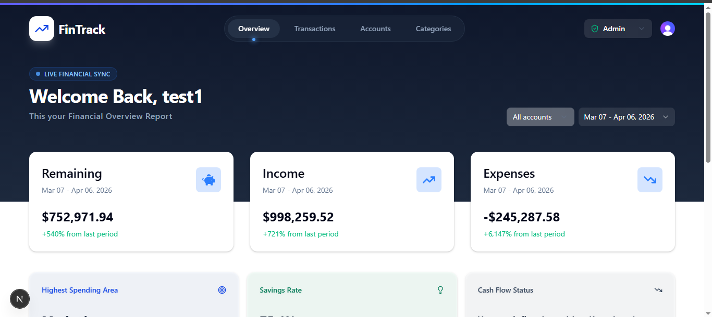
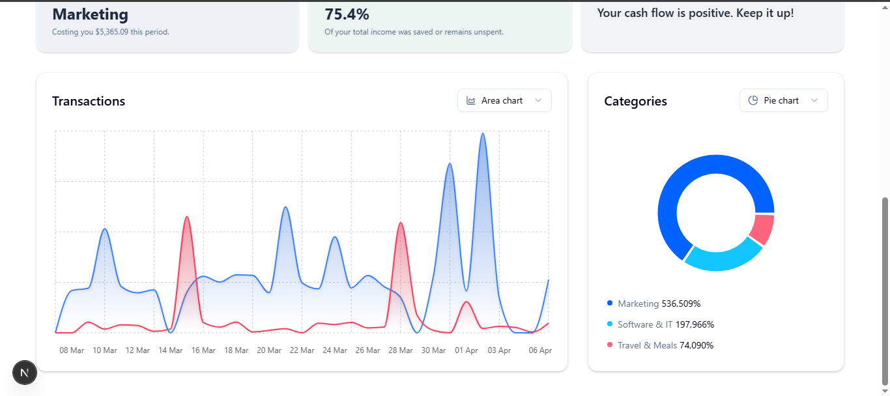
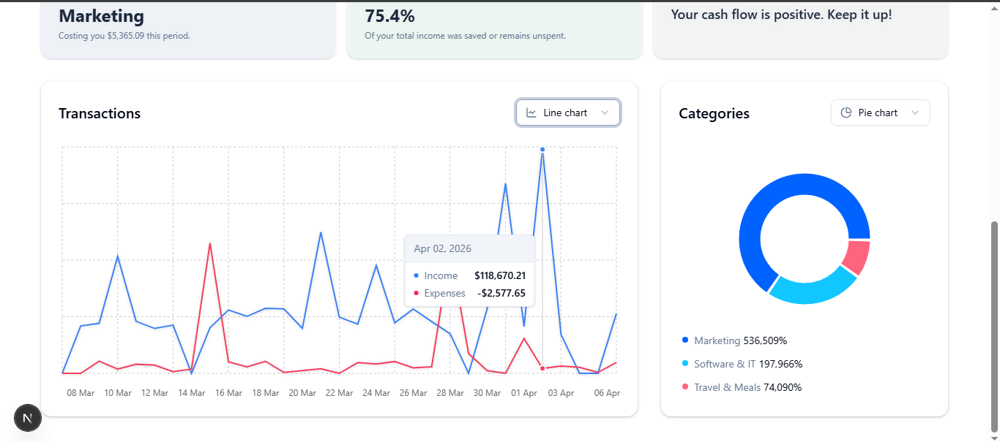
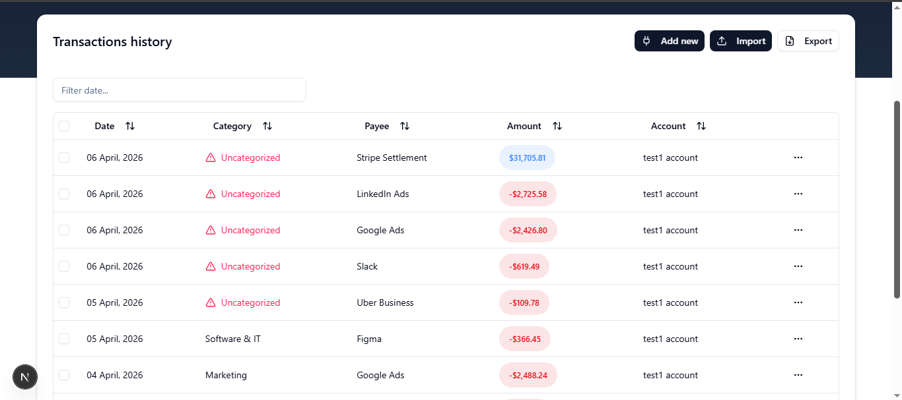

# 📊 Finance Dashboard

## 🔗 Live Link

[**View Live Application**](https://finance-dashboard-nine-snowy.vercel.app/)

FinTrack AI is a modern, full-stack personal finance dashboard designed to help users track expenses, visualize spending habits, and manage their cash flow. It features a robust interactive data grid, dynamic data visualizations, and Role-Based Access Control (RBAC).

---

## 📸 Screenshots

<table align="center" width="100%">
  <tr>
    <td width="50%" align="center">
      
    </td>
    <td width="50%" align="center">
      
    </td>
  </tr>
  <tr>
    <td width="50%" align="center">
      
    </td>
    <td width="50%" align="center">
      
    </td>
  </tr>
</table>

---

## ✨ Features

- **Interactive Data Visualizations:** Dynamic charting system toggling between Area, Line, and Bar charts for trends, and Pie, Radar, and Radial charts for category breakdowns.
- **Smart Insights:** Automatically calculates the highest spending category, savings rate, and overall cash-flow health based on the selected date range.
- **Advanced Transactions Grid:** Includes column sorting, date filtering, and visual badges for income/expense tracking.
- **CSV Bulk Import:** A drag-and-drop file uploader that parses CSV data and maps it directly to the database schema.

## 🛠️ Tech Stack

**Frontend:**

- **Next.js (App Router):** For optimized routing and server-side rendering capabilities.
- **Tailwind CSS & Shadcn UI:** For a clean, accessible, and highly responsive user interface.
- **TanStack React Query:** Manages server state, caching, and optimistic UI updates.
- **Zustand:** Handles lightweight client-side UI state (e.g., modal visibility and RBAC simulation).
- **Recharts & TanStack Table:** For complex data visualizations and grid management.

**Backend:**

- **Hono.js:** Lightweight, Edge-compatible API routes.
- **Neon PostgreSQL:** Serverless relational database.
- **Drizzle ORM:** Type-safe database queries and migrations.
- **Clerk:** Secure user authentication.

---

## 🛠️ Setup Instructions

To run this full-stack application locally, you will need to configure a PostgreSQL database and Clerk authentication.

### Prerequisites

- Node.js (v18+)
- A free [Neon Database](https://neon.tech/) account
- A free [Clerk](https://clerk.com/) account for authentication

### 1. Clone the repository

```bash
git clone https://github.com/rupeshpatil27/finance-dashboard.git
cd finance-dashboard
```

### 2. Install dependencies

```bash
npm insall
```

### 3. Environment Setup

Create a .env.local file in the root and add your credentials:

```bash
NEXT_PUBLIC_CLERK_PUBLISHABLE_KEY=...
CLERK_PUBLISHABLE_KEY=...
CLERK_SECRET_KEY=...
NEXT_PUBLIC_CLERK_SIGN_IN_URL=...
NEXT_PUBLIC_CLERK_SIGN_UP_URL=...
NEXT_PUBLIC_APP_URL=...
DATABASE_URL=...
```

### 4. Database Initialization

```bash
npm run db:generate
npm run db:migrate
```

### 5. Launch Development Server

```bash
npm run dev
```
